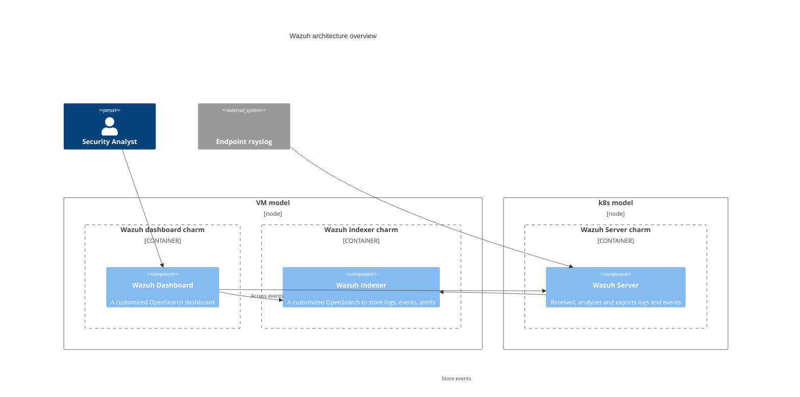

# Architecture overview

Wazuh is a security platform that provides unified XDR and SIEM protection for endpoints and cloud workloads. The solution is composed of a single universal agent and three central components: the Wazuh server, the Wazuh indexer, and the Wazuh dashboard.

The universal agent is not yet available in the charmed Wazuh ecosystem. Logs are collected through an agentless architecture relying on `rsyslog`.

