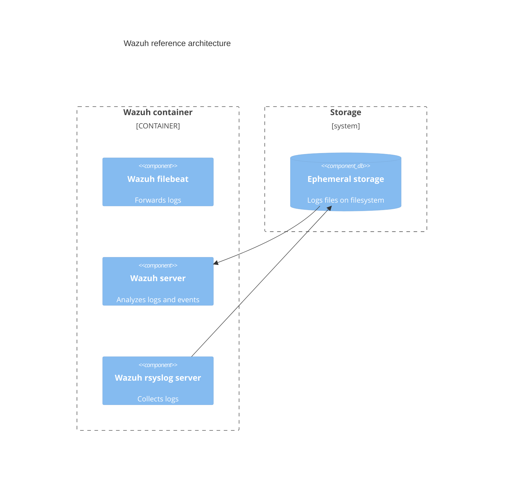

# Charm architecture

The charm design leverages the [sidecar](https://kubernetes.io/blog/2015/06/the-distributed-system-toolkit-patterns/#example-1-sidecar-containers) pattern to allow multiple containers in each pod
with [Pebble](https://juju.is/docs/sdk/pebble) running as the workload
container’s entrypoint.

If you run `kubectl get pods` on a namespace named for the Juju
model you've deployed the Wazuh server charm into, you'll see something like the
following:

```bash
NAME                             READY   STATUS    RESTARTS   AGE
wazuh-server-0                    2/2     Running   0         6h4m
```

This shows there are 2 containers:

1. A [Wazuh server](https://wazuh.com/) container, which
has Wazuh server installed and configured alongside several collectors and
[Filebeat](https://www.elastic.co/beats/filebeat) to ingest and export logs.
2. A sidecar containing Pebble: a lightweight, API-driven process supervisor that is responsible for
configuring processes to run in the workload container and controlling those processes
throughout the workload lifecycle.

## OCI images

We use [Rockcraft](https://canonical-rockcraft.readthedocs-hosted.com/en/latest/)
to build the OCI image for Wazuh server.
The image is defined in [Wazuh server rock](https://github.com/canonical/wazuh-server-operator/blob/main/rock/rockcraft.yaml) and is published to [Charmhub](https://charmhub.io/), the official repository
of charms.
This is done by publishing a resource to Charmhub as described in the
[Charmcraft how-to guides](https://canonical-charmcraft.readthedocs-hosted.com/en/stable/howto/manage-charms/#publish-a-charm-on-charmhub).

## Wazuh server

Wazuh server is an application controlled by the `/var/ossec/bin/wazuh-control` script. Alongside it, several collectors and a filebeat instance is deployed to ingest and export the logs.

The Wazuh server listens on ports:

- 1514 and 1515: for the Wazuh agents to connect;
- 55000: to access Wazuh's API.

The collectors deployed are:
- rsyslog, which listens on port 6514 for remote servers to send logs over TLS;



The workload that this container is running is defined in the [Wazuh server rock](https://github.com/canonical/wazuh-server-operator/blob/main/rock/rockcraft.yaml).


## Storage

The Wazuh server charm mounts a [filesystem type storage](https://documentation.ubuntu.com/juju/3.6/reference/storage/#defining-storage) to store the incoming rsyslog logs and any other data that requires persistence across container restarts.

## Charm code overview

The `src/charm.py` is the default entry point for a charm and has the
`WazuhOperatorCharm` Python class which inherits from the `CharmBase`.

CharmBase is the base class from which all Charms are formed, defined by [Ops](https://juju.is/docs/sdk/ops)
(Python framework for developing charms).

See more information in [Charm](https://documentation.ubuntu.com/juju/3.6/reference/charm/).

The `__init__` method guarantees that the charm observes all events relevant to
its operation and handles them.

Take, for example, when a configuration is changed by using the CLI.

1. User runs the command

  ```bash
  juju config wazuh-server custom-config-repository=git+hhtp://github.com/sample-repository.git
  ```

2. A `config-changed` event is emitted
3. Event handlers are defined in the charm's framework observers. An example looks like the following:

```python
self.framework.observe(self.on.config_changed, self._on_config_changed)
```

4. The method `_on_config_changed` will take the necessary actions. 
The actions include waiting for all the relations to be ready and then configuring
the container.
